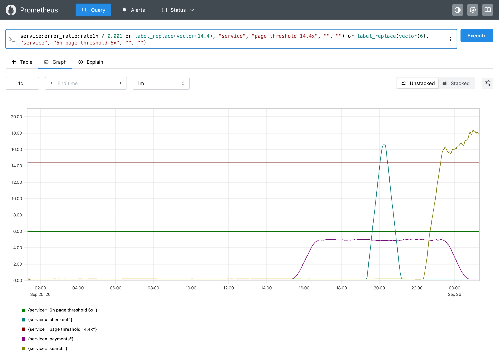
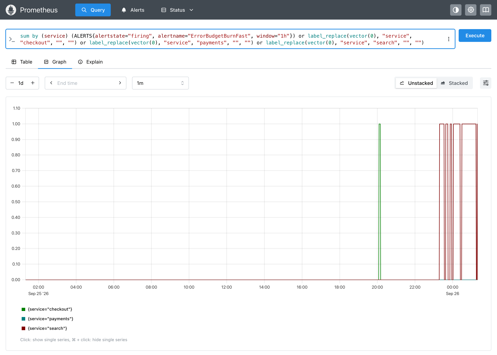
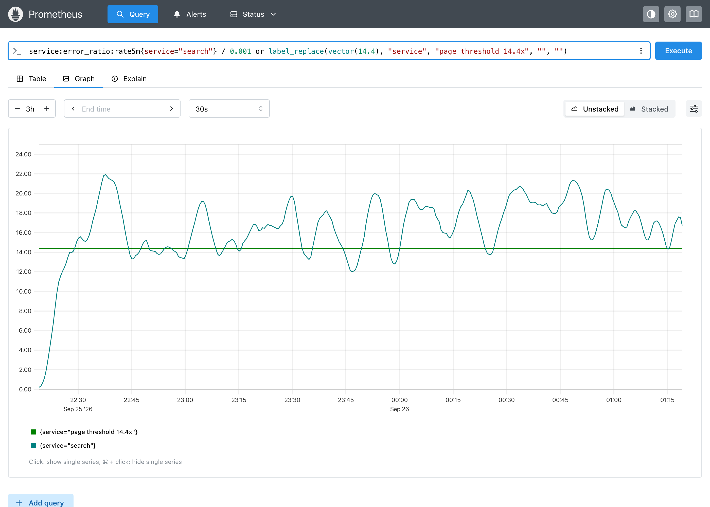

# Demo: blind spots of burn-rate alerts

Multi-window, multi-burn-rate alerts from the [Google SRE workbook](https://sre.google/workbook/alerting-on-slos/) are the standard way to alert on an SLO. How do they behave on messy, realistic traffic? We replay three services through a real Prometheus and find out, with a day of history evaluated in seconds.

## The alerts

A 99.9% availability SLO (error budget: 0.1% of requests), with the workbook's thresholds and the `for` durations used in the [kubernetes-mixin](https://github.com/kubernetes-monitoring/kubernetes-mixin). From [`rules.yaml`](../examples/fast-burn/rules.yaml):

| Alert | Long window | Short window | Burn rate | `for` | Meaning |
|---|---|---|---|---|---|
| Page | 1h | 5m | > 14.4× | 2m | 2% of the monthly budget gone in 1h |
| Page | 6h | 30m | > 6× | 15m | 5% gone in 6h |
| Ticket | 1d | 2h | > 3× | 1h | 10% gone in 1d |

## The services

All three are jagged (`noise`), not clean rectangles, and fixed with a `seed` so the run is reproducible.

| Service | Profile | What happens |
|---|---|---|
| checkout | Real incident | 20× burn (2% errors) for 45m, 6h ago |
| payments | Slow burn | 5× burn (0.5% errors) for 8h |
| search | Near the threshold | About 16.5× burn with heavy jitter, still ongoing |

## Run it

```bash
make clean && make up
./examples/fast-burn/run.sh
```

It backfills 24h for each service, then loads the rules with rule backfill, so the alert history for the whole day is there in a few seconds.

## What happened

The 1h burn rate for each service, against the 14.4× and 6× page thresholds:



Pages from the 1h/5m alert, per service:



| Service | Result | Budget burned in 24h |
|---|---|---|
| checkout | Paged **45 minutes after** the incident started, for 5 minutes, just before it ended | 2.9% of 30 days |
| payments | **Never alerted.** No page, no ticket. | 6.0% of 30 days |
| search | Paged **6 separate times** in 2h instead of once | 7.5% of 30 days |

## The blind spots

### 1. A 20× incident pages late

The 1h window has to average above 14.4× before the alert can fire. At 20×, that takes 60m × 14.4 / 20 ≈ **43 minutes**, plus `for: 2m`. The page arrived as the incident was ending. That's exactly the workbook's detection-time formula, now visible on a graph. Only incidents far above 14.4× page quickly; a moderate one is caught late or not at all.

### 2. A steady 5× burn is invisible

5× is below the 6× page and never reaches 3× over a whole day, so the ticket doesn't fire either. Payments quietly burned 6% of its monthly budget in one day. Kept up for five days, that's nearly a third of the budget, and nobody is told. The workbook's 3d/6h ticket (> 1×) is meant for this case, which is an argument for keeping it (testing it takes a 3-day window).

### 3. Jitter turns one incident into six pages

Search burns steadily above the threshold, but its 5m window is jagged: every dip below 14.4× resets `for: 2m`, and the alert resolves and re-fires.



With the same average burn and **no** noise, the alert fires **once** and stays firing. The clean profile hides the problem entirely. The 6h/30m page, with its longer windows and `for: 15m`, did fire once and stayed stable, but only after about 2.5 hours.

## What to do about it

Each of these is one edit to `rules.yaml` and one re-run to check:

- **Late pages:** add a higher-threshold page on shorter windows for severe incidents, or accept the delay for moderate ones knowingly.
- **Silent slow burns:** keep a 3d/6h ticket, or add a budget-remaining alert, so a steady 5× gets flagged.
- **Flapping pages:** add `keep_firing_for: 5m` to the 1h/5m page, so short dips below the threshold don't resolve it. Replayed on the same data, search then pages **once** instead of six times, at the same moment. Rule backfill simulates `keep_firing_for`, so this takes one re-run to check.

## More

- [Flaky dependency demo](demo.md): a threshold alert vs a fast-burn alert on self-healing spikes
- [Profiles](profiles.md): the shapes and noise parameters used here
