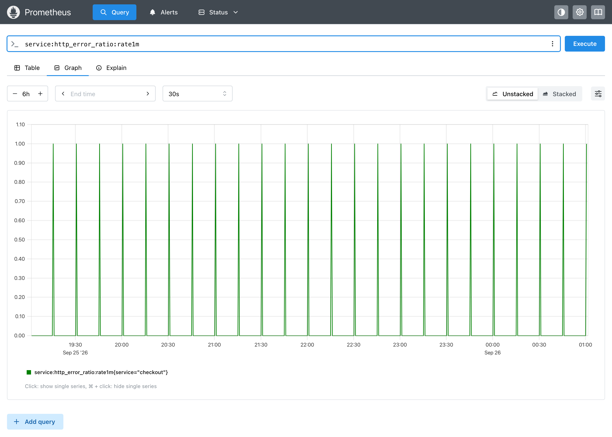
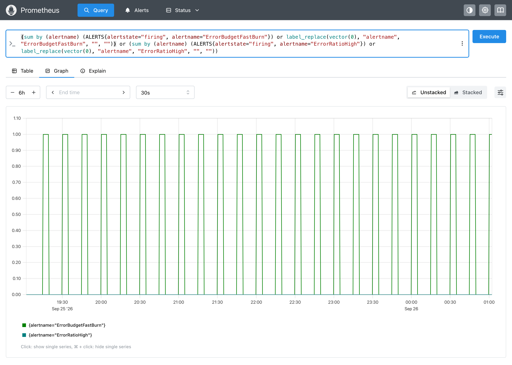

# Demo: a flaky dependency

A dependency fails completely for 30 seconds every 15 minutes, then recovers on its own. Nobody needs to wake up for that. What do our alerts do?

## Run it

```bash
make up
go run ./cmd/emit --shape spikes --params every=15m,width=30s \
  --template examples/profiles/error-ratio.tmpl \
  --rules examples/profiles/rules.yaml
```

This backfills 6h of the profile and evaluates [the rules](../examples/profiles/rules.yaml) over it, which takes a few seconds. Everything below is in Prometheus immediately.

## The profile

`service:http_error_ratio:rate1m`: 24 short bursts at 100% errors, and nothing in between.



## What the alerts did

Firing alerts over the same 6h:



- **`ErrorRatioHigh`** (`> 5%` over 1m, `for: 3m`) never fires. Each spike clears long before `for` runs out. This is the behavior we want.
- **`ErrorBudgetFastBurn`** (1h and 5m burn rate over 14.4× for a 99.9% SLO, no `for`) fires on **every** spike: 24 pages in 6 hours. A single 30s outage is enough to push both windows over the threshold.

## What it tells us

The burn-rate alert has a blind spot of its own: it can't tell a self-healing flake from a real outage, so it pages on both.

The obvious fix is a `for`, but how long? Rule backfill answers that in seconds. The same fast-burn expression, evaluated over the same 6h:

| `for` | Pages in 6h |
|---|---|
| none | 24 |
| `2m` | 23 |
| `5m` | 0 |

`for: 2m` barely helps. A 30s spike keeps the 5m window above the threshold for about 4 minutes, so the condition outlasts a 2m `for`. It takes `for: 5m` to silence the flake.

That has a cost: a real outage now pages 5 minutes later. Options for the SRE team:

- Accept the delay. Run the [launch profile](profiles.md#the-five-profiles) to confirm a real surge still pages early enough.
- Keep the fast page, and handle recurring flakes separately: a lower-severity ticket on the dependency instead of a page for the on-call.

Each option is one edit to the rules and one re-run.

## More

- [kube-apiserver](../examples/kube-apiserver/README.md): a p99 alert on a long tail, while p50 stays flat.
- [Profiles](profiles.md): the other failure shapes (bad deploy, launch, flapping, slow drift) and how to add noise.
