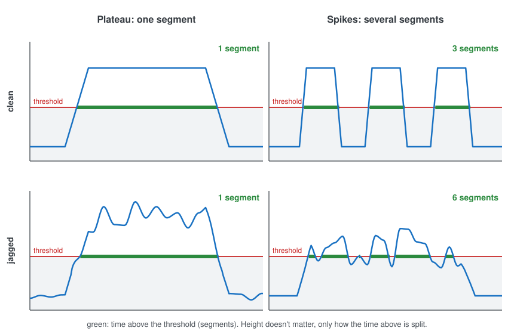
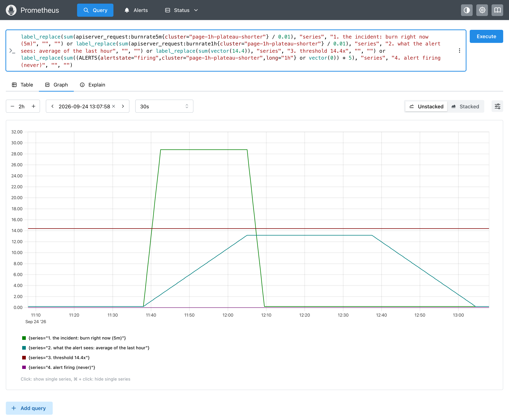
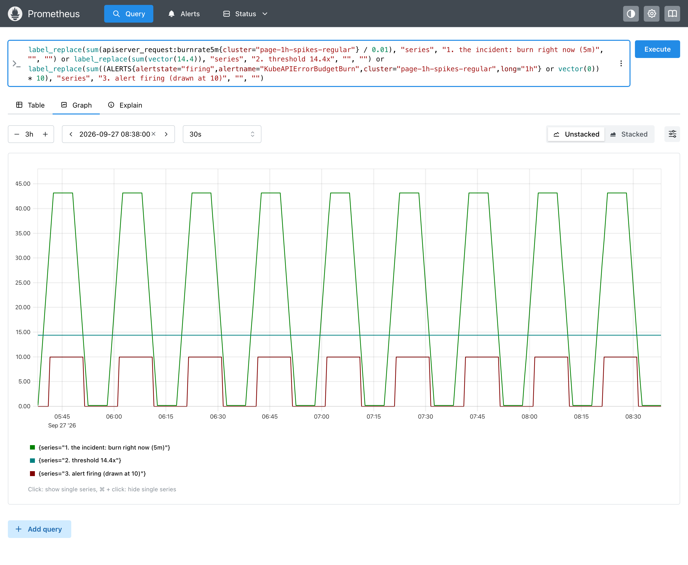
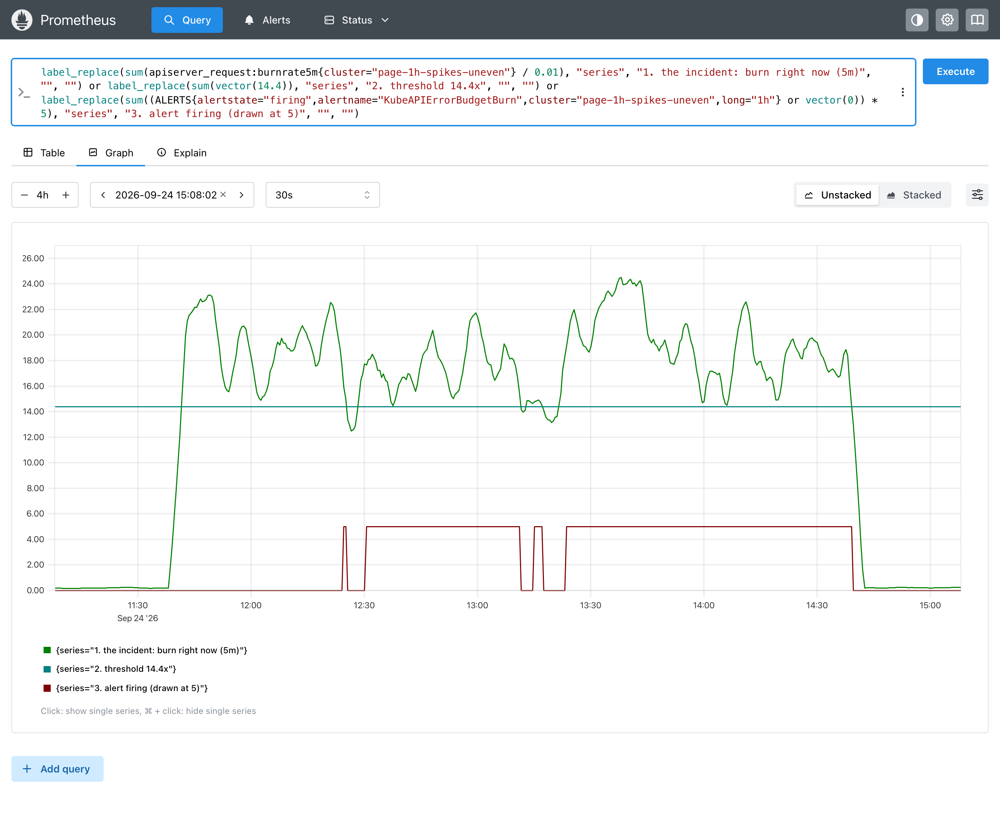
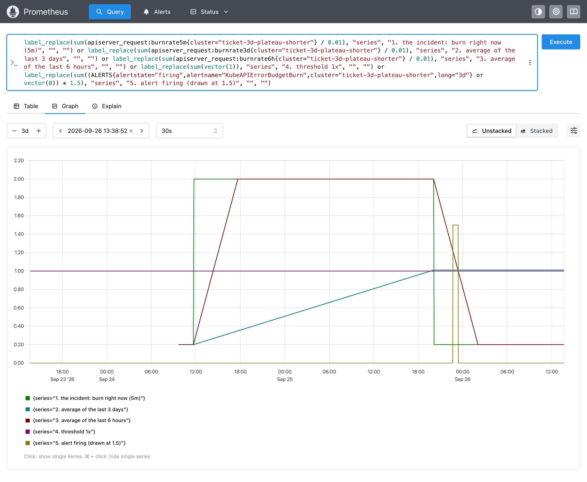
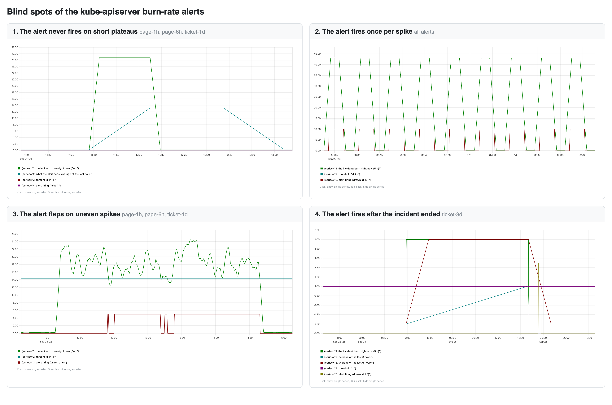
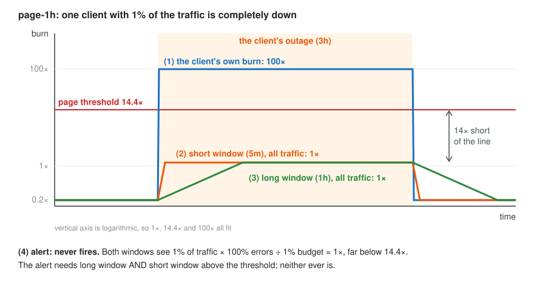

# Workflow: designing a kube-apiserver burn-rate alert

This example designs and verifies an alert with metrics-replayer, using a reusable, systematic approach that works for any alert. The result is the alert's **profile**: a tested description of how it behaves on every kind of shape it can face.

**Task:** alert on the kube-apiserver's availability SLO, following the Google SRE workbook's multi-window, multi-burn-rate convention.

## 1. Intent

**SLO:** 99% of apiserver requests are good over 30 days (error budget: 1%). A request is **bad** if it fails (5xx) or is slower than 1s.

**Intent:** when the budget burns faster than a tier's threshold, that tier's alert **must fire**. Page versus ticket doesn't matter for this method; each tier is simply an alert that must fire.

## 2. Design

The workbook's four tiers, with the `for` durations from the kubernetes-mixin ([`rules.yaml`](rules.yaml)):

| Alert | Long window | Short window | Threshold | `for` |
|---|---|---|---|---|
| page-1h | 1h | 5m | 14.4× | 2m |
| page-6h | 6h | 30m | 6× | 15m |
| ticket-1d | 1d | 2h | 3× | 1h |
| ticket-3d | 3d | 6h | 1× | 3h |

## 3. The method

**Step 1: an alert is a shape classifier.** An alert is a function: it takes a series of points over time, a **shape**, and decides at every moment whether to fire. For these burn-rate rules:

```
condition(t) = long-window average > threshold  AND  short-window average > threshold
fire at t    if condition has held for the whole `for` duration
```

**Step 2: the problem space.** Picture a shape as the Prometheus console draws it: time left to right, value (here, the burn rate) going up, never below zero. The problem space is every line that could be drawn there, which is endless, so we narrow it down.

**Step 3: narrow it to a rectangle.** Note that the shape here is **what the alert sees**, not the incident itself: the signal after the alert's windows have averaged it over time and its SLI has summed it over all traffic. The alert only checks whether that value is **above the threshold**, so everything below it can be ignored, and above it, **height doesn't matter**. It has a **limited memory**: it takes the whole shape, but each decision depends only on what its window currently covers. And it fires only once the condition has held for **`for`**, so above the threshold only time counts. That leaves a **rectangle**: bottom edge = threshold, width = `for`, open top. With two windows, each has its own rectangle, and the alert needs both (AND).


Both rectangles in the drawing are the same one at two moments: in orange, the shape drops out before `for` and it starts over; in green, it stays inside for the whole width and the alert fires. From here on, the problem space is just the inside of the rectangle.

Besides the problem space, this narrows down two more things:

1. **What to test.** What the alert sees outside the rectangle can't make it fire, so we don't need to explore those shapes. We test the incidents the alert is meant to catch, and check whether what the alert sees lands inside.
2. **How to group what's inside.** The shapes in the rectangle can be grouped in three ways: by **shape class**, by **cause of incident**, and by **how likely each shape is**. We'll get to each later.

**Step 4: group what's inside.**

- **By shape class.** Inside the rectangle, a shape is either a **plateau** (one stretch above the threshold) or **spikes** (several stretches with gaps between them). There is no third option, so every shape falls in exactly one class.
- **By cause.** An incident is either a **dependency becoming unavailable** (e.g. etcd, the network, a cloud provider) or an **internal problem** (a bad deploy, a bug, overload).
- **By probability.** From experience, we hypothesize how likely each combination is: high, medium or low.



Real signals are jagged: traffic, retries and partial failures make them wobble all the time, and the clean shapes are only idealizations. A jagged plateau is still a plateau as long as it never drops below the threshold. Once jitter makes it dip, it becomes spikes. That's why tests should use jagged shapes.

| Cause | Shape class | What it typically looks like | Probability (hypothesis) |
|---|---|---|---|
| Dependency unavailable | plateau | Far above the threshold, starts and ends abruptly | low |
| Dependency unavailable | spikes | A dependency that keeps dropping and recovering | medium |
| Internal problem | plateau | A bad deploy, until it's rolled back | medium |
| Internal problem | spikes | Partial failures hovering near the threshold, jagged | high |

Why spikes rank highest: the apiserver is a **resilient** service, with multiple replicas, load balancing, retries and backpressure. When something goes wrong, usually only part of the requests fail, intermittently, and that shows up as spikes. A plateau needs all that resilience to fail at once, typically as a **surge**: a sudden, steep rise that crosses the threshold and stays above it. Surges are more catastrophic but rarer. Spikes do less damage, but they are harder to manage: they flap, reset `for`, and page repeatedly.

These probabilities are **relative to the component**, not overall: they compare the causes of *this* component's incidents with each other. For example, the apiserver itself is more likely to become unavailable than the node it runs on. Likewise, a cloud provider's VMs (e.g. on AWS) are more reliable, with higher SLAs, than the tenant applications running on them. With good engineering, the lower layers are more reliable than what runs on top of them, so for the apiserver, a dependency outage is the rarer cause. We also bias the tests deliberately toward the component's **own** unavailability: detecting this component's problems is what the alert is for.

They're a starting hypothesis, not a measurement. Their job is to decide what to test first and most carefully.

**Step 5: plan the tests.** The intent drives the tests. When we write an alert's rule (its query, windows, thresholds and `for`), we assume it complies with the intent; the tests verify that assumption. Only replay incidents that belong in the rectangle by intent, the ones the alert must catch; there's no need to test shapes blindly. When one of them doesn't fire, what the alert saw didn't reach the rectangle, and that's a blind spot. Replay instances of each class, all of which **must fire**, varying only what the alert can tell apart: time.

1. **Spikes.** Vary the **width** of each spike (shorter than, about, and longer than `for`) and the **gap** between spikes (shorter than, about, and longer than the short window).
2. **Plateaus.** Vary the **width** (duration) around the point where the long window can first cross the threshold, from too short to long, including a **surge**: a steep rise followed by a slow decay.
3. **Traffic slices.** An incident that hits only part of the traffic, such as one small client that is completely down. Its own shape is inside the rectangle, but the alert measures all traffic together, which can push the shape it actually sees below the threshold.

For each instance, report the alert's performance:

| Measure | Question it answers |
|---|---|
| Fired | Did it fire at all? |
| Time to fire | How long after the incident started? |
| Firings | How many separate firings for one incident (1 is ideal; more means flapping)? |
| Late firing | Did it fire after the incident had already ended? |

Together, these measures across all instances are the alert's **profile**.

The test matrix is in [`scenario.yaml`](scenario.yaml). One command replays it and prints the report:

```bash
make clean && make up
./examples/kube-apiserver-slo/run.sh            # add --markdown for a Markdown table
```

**Step 6: run the tests and read the profile.** `run.sh` replays all 26 instances (4 alerts × 6, plus 2 traffic-slice instances), each with 6 days of jagged, seeded traffic, and evaluates the rules over the last 3 days. The report, condensed (✓ fired, ✗ didn't; time from the start of the incident to the first firing; "fires" is the number of separate firings):

| Alert | plateau long | plateau short (0.6 L) | plateau shorter (0.45 L) | spikes regular | spikes uneven | spikes degrading |
|---|---|---|---|---|---|---|
| page-1h | ✓ 32m | ✓ 32m | **✗** | ✓ **216 fires** | ✓ 46m, **4 fires** | ✓ 39m |
| page-6h | ✓ 3.2h | ✓ 3.2h | **✗** | ✓ **36 fires** | ✓ 4.7h, **2 fires** | ✓ 3.8h |
| ticket-1d | ✓ 12.6h | ✓ 12.6h | **✗** | ✓ **9 fires** | ✓ 20.5h, **5 fires** | ✓ 15.3h |
| ticket-3d | ✓ 35h | ✓ 35h | ✓ 35h, **2.6h after it ended** | ✓ **3 fires** | ✓ 53.6h | ✓ 52.6h |

(L is the alert's long window. The regular spikes run the whole window, so what matters for them is the number of firings, not the time to the first one.)

What the profile says:

- **On a plateau, the alert fires after a fixed delay.** The delay is the time from the start of the incident to the first firing. At 2× the threshold it's about half the long window, plus `for`: 32m, 3.2h, 12.6h, 35h. The plateau's width doesn't change *when* the alert fires, only *whether* it does.
- **On short plateaus, the alert never fires.** In the graph below, a 27-minute incident at 28.8× burn **(1)** is far above the threshold **(3)**. But the alert doesn't watch the incident directly; it watches the average of the last hour **(2)**. With only 27 bad minutes in the hour, that average climbs to just 13.2× and flattens out below the 14.4× threshold, so the alert **(4)** never fires. At 2× the threshold, any plateau shorter than half the long window stays invisible like this to page-1h, page-6h and ticket-1d.

  

- **On regular spikes, the alert fires once per spike.** In the graph below, the incident **(1)** rises above the threshold **(2)** every 20 minutes and drops below it in between. Each time it rises, the alert **(3)** fires; each time it drops, the alert resolves. That's a separate firing per spike: 216 in 3 days for page-1h.

  

- **On uneven spikes, the alert flaps.** Below, the incident **(1)** stays above the threshold **(2)** most of the time, but dips under it now and then. Every dip resolves the alert **(3)**, and it has to wait `for` again before firing, so one ongoing incident fires 4 separate times.

  

- **ticket-3d can fire after the incident is over.** Below, the incident **(1)** runs at 2× for 32 hours. The average of the last 3 days **(2)** climbs slowly and only reaches the 1× threshold **(4)** as the incident ends. The average of the last 6 hours **(3)** is still above the threshold at that point, so both conditions hold, and after `for: 3h` the alert **(5)** fires, hours after the incident is over. That's also why it fired on this short plateau at all: over 3 days, the low background burn adds just enough to push **(2)** over the line.

  

**Step 7: decide.** Every instance should have fired exactly once, soon after its incident started. Each deviation is a blind spot, now explicit and reproducible:




| Blind spot | Alerts | Options |
|---|---|---|
| The alert never fires on short plateaus | page-1h, page-6h, ticket-1d | Accept and document it ("a 2× incident shorter than half the long window isn't alerted on"), or add a tier with a shorter long window |
| The alert fires once per spike | all | `keep_firing_for` longer than the gap between spikes, so a recurring problem is one incident |
| The alert flaps on uneven spikes | page-1h, page-6h, ticket-1d | `keep_firing_for` to bridge short dips |
| The alert fires after the incident ended | ticket-3d | Accept it for a ticket, or shorten `for` |
| The alert never fires when one client is down (dilution) | page-1h, page-6h, ticket-1d | SLOs or burn-rate alerts per client or per critical path |
| Throttled requests (429) aren't counted at all | all | Decide whether 429s count as bad, and alert on them separately if not |

**Traffic slices: a client that is completely down.** Two more instances: a big client with 99% of the traffic, healthy, and a small client with 1% that fails **all** its requests for 3 hours. In `client-down-5xx` the failures are 5xx errors. In `client-throttled-429` they are 429 rejections, the way API Priority and Fairness throttles a client. Any tier must fire.

| Instance | Small client | What the alerts saw (5m and 1h burn) | Fired |
|---|---|---|---|
| client-down-5xx | 100% failing | 1.2× | **✗ no tier** |
| client-throttled-429 | 100% rejected | 0.2× (the background only) | **✗ no tier** |

Two blind spots stack up here:

- **Dilution.** The burn rate is computed over all traffic, so a client with 1% of the requests failing completely only shows up as 1% × 100% ÷ 1% budget = 1× (1.2× with the background). The client's own burn **(1)** is 100×, but both of page-1h's windows, the 5m short window **(2)** and the 1h long window **(3)**, see only the diluted value, and the alert **(4)** never fires. The same holds on page-6h and ticket-1d; only ticket-3d, whose threshold is 1×, could catch a longer outage, days later.

  

- **Uncounted failures.** The SLI counts 5xx and slow requests as bad. A 429 is neither, so a throttled client doesn't even raise the burn: it stays at the 0.2× background. Even an alert measured per client wouldn't see it.

Remedies to design and then replay: SLOs or burn-rate alerts per client (or per critical path), so each one is measured against its own traffic, and deciding whether 429s should count as bad.

After a change, re-run the same scenario (`make clean && make up` first) and compare the reports.

The result is the alert's **profile**: its documented behavior. With it, SREs in production already know how the alert performs, including how fast it fires, what it can't see and when it will flap, without retesting, guessing, or waiting for an incident to find out.
