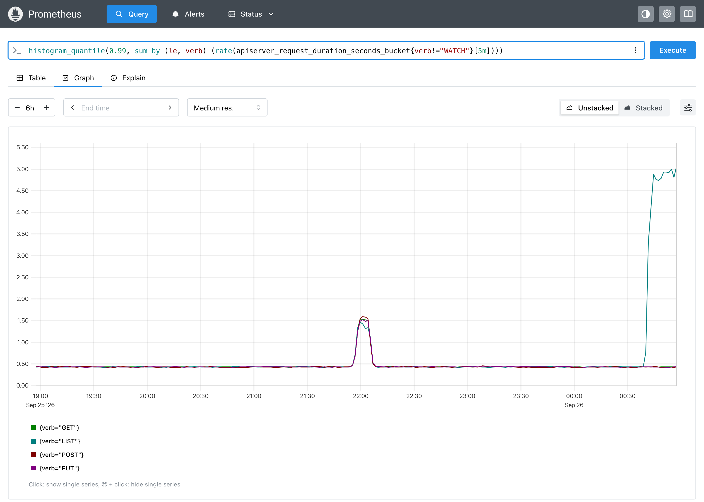
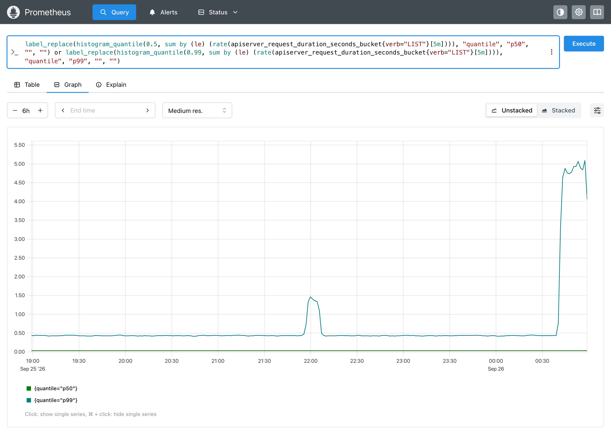
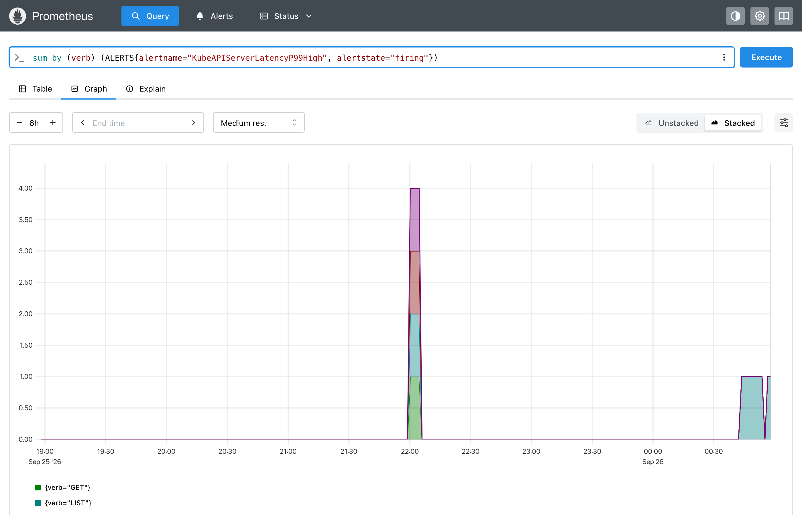

# kube-apiserver long-tail latency

Simulates kube-apiserver request latency and tests a p99 alert against a **long tail**: most requests stay fast, so p50 looks healthy, but a small share of slow requests pushes p99 above 1s.

## Run

```bash
make clean && make up
./examples/kube-apiserver/run.sh
```

Open [localhost:9091](http://localhost:9091) and graph over the last 6h:

```promql
histogram_quantile(0.99, sum by (le, verb) (rate(apiserver_request_duration_seconds_bucket{verb!="WATCH"}[5m])))
histogram_quantile(0.5,  sum by (le, verb) (rate(apiserver_request_duration_seconds_bucket{verb!="WATCH"}[5m])))
ALERTS{alertname="KubeAPIServerLatencyP99High"}
```

**p99 by verb.** The etcd compaction 3h ago lifts every verb to about 1.5s. The unpaginated LIST in the last 15 minutes lifts only LIST, to about 5s.



**p50 vs p99 for LIST.** On the same scale, p50 stays flat near zero (about 0.04s) through both incidents. Only the tail moves, so a median-based alert would see nothing.



**Firing alerts per verb, stacked.** This is backfilled alert history, with `for: 2m` applied: all four verbs fire during the compaction, and only LIST at the end. The short gap at the far right is where the backfilled history ends and Prometheus' own live evaluation starts its 2m `for` over.



## Traffic profile

The script backfills 6h of history, then pushes live every 2s.

| When | What happens | p50 | p99 |
|---|---|---|---|
| 6h → 3h ago | Normal traffic | ~0.04s | ~0.43s |
| 3h ago, 10 min | etcd compaction: 2% of all requests take 1–4s | ~0.04s | ~1.5s (all verbs) |
| Last 15 min | A controller runs unpaginated `LIST pods`: 4% of LISTs take 2–8s | ~0.04s | ~5s (LIST only) |
| Live, first ~4 min | The LIST tail continues, then the controller is fixed | ~0.04s | LIST drops back below 1s |

Series (verb / resource / requests per second): `GET pods` 40, `LIST pods` 8, `POST pods` 5, `PUT configmaps` 10, and `WATCH pods` 2. Every WATCH lasts 30–60s.

## Rule and alert

From [`rules.yaml`](rules.yaml):

```yaml
- record: cluster_quantile:apiserver_request_duration_seconds:histogram_quantile
  expr: |
    histogram_quantile(0.99, sum by (le, verb, resource) (
      rate(apiserver_request_duration_seconds_bucket{verb!~"WATCH|CONNECT",subresource!~"exec|attach|log|portforward|proxy"}[5m])
    ))
  labels:
    quantile: "0.99"
- alert: KubeAPIServerLatencyP99High
  expr: cluster_quantile:apiserver_request_duration_seconds:histogram_quantile{quantile="0.99"} > 1
  for: 2m
```

Long-running requests are excluded: watches, `CONNECT`, and the `exec`/`attach`/`log`/`portforward`/`proxy` subresources. They are slow by design, and without the filter p99 would sit at the top bucket (60s) permanently.

## What to expect

The rules are loaded with [rule backfill](../../docs/api.md#rule-backfill), so the full 6h of alert history appears right away, with `for: 2m` applied:

- **3h ago, etcd compaction:** `KubeAPIServerLatencyP99High` fires for every verb (GET, LIST, POST, PUT) for roughly the length of the compaction, plus the time the 5m rate window takes to drain.
- **Last 15 minutes, unpaginated LIST:** it fires for `verb="LIST", resource="pods"` only. The other verbs stay below 1s, and p50 stays flat throughout.
- **Live:** Prometheus picks up from there. The LIST alert is pending right away and firing again after 2 minutes. About 4 minutes in, the tail ends, the 5m window drains, and the alert resolves a few minutes later.

## Files

- `run.sh`: registers the `kube-apiserver` stream and runs the profile.
- `profile.awk`: backfills 6h of metrics (relative timestamps, sent with `?align=now`), loads `rules.yaml` with `?backfill=6h`, then pushes live. Edit `spec` for the series and `tick()` for the incidents.
- `rules.yaml`: the recording rule and alert.
